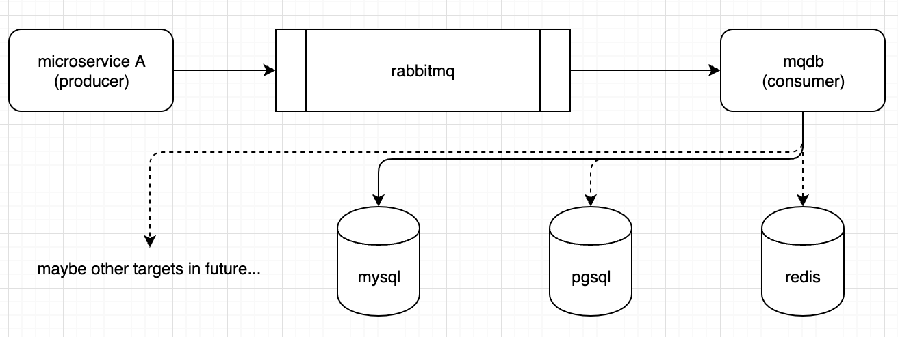

# mqdb

mqdb aims to separate storage functions from the main businesses of services and to solve the high performance problem of development of distributed system.

The software is provided as is under no guarantee. 

## design




## build

```bash

$ cd src
$ go mod init mqdb/src
$ go mod tidy

$ CGO_ENABLED=0 GOOS=linux GOARCH=amd64 go build -o mqdb

```

